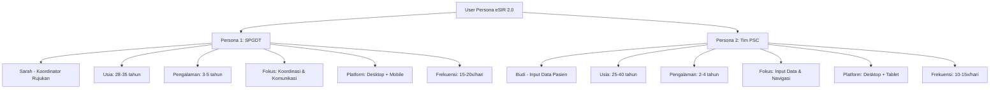
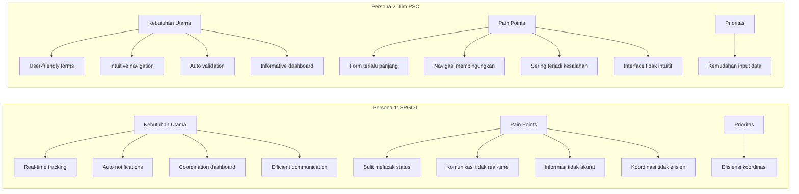
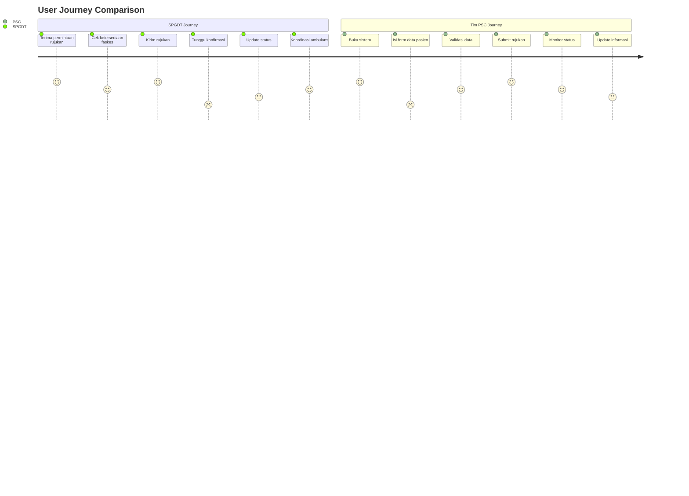
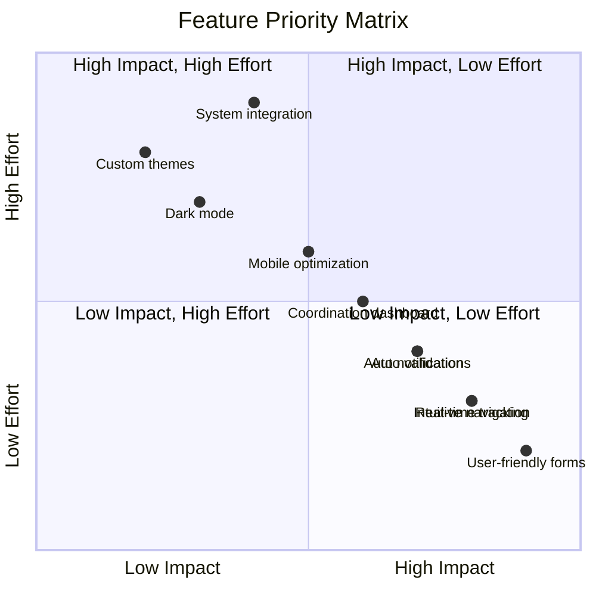
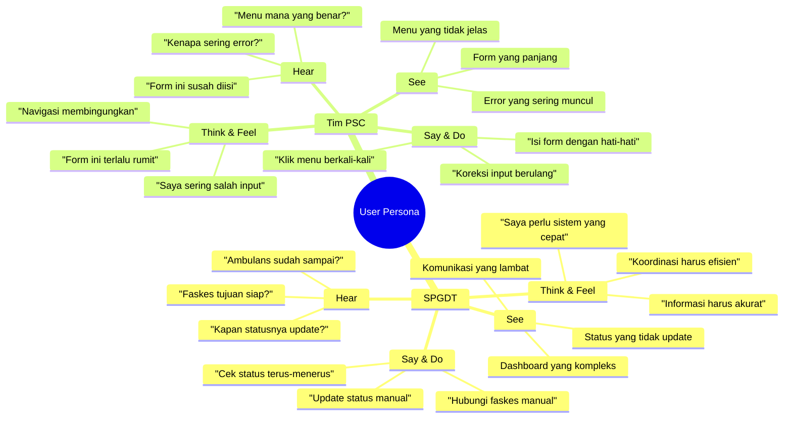
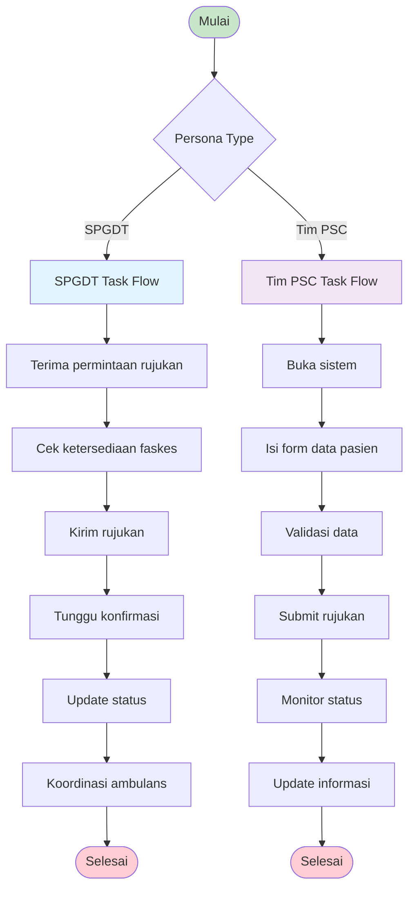

# User Persona Visualization - eSIR 2.0

## Diagram 1: User Persona Overview

## Diagram 2: Needs & Pain Points Analysis

## Diagram 3: User Journey Comparison

## Diagram 4: Feature Priority Matrix

## Diagram 5: Empathy Map

## Diagram 6: Task Flow Comparison

## Panduan Implementasi Visual:

### 1. Tools yang Direkomendasikan:
- **Mermaid Live Editor** (https://mermaid.live/) - Untuk diagram teknis
- **Figma** - Untuk desain visual yang lebih menarik
- **Draw.io** - Untuk diagram yang lebih kompleks
- **Canva** - Untuk template yang sudah jadi

### 2. Elemen Visual yang Perlu Ditambahkan:
- **Ikon**: Gunakan ikon yang konsisten untuk setiap kategori
- **Warna**: Skema warna yang berbeda untuk setiap persona
- **Typography**: Font yang mudah dibaca dan profesional
- **Layout**: Struktur yang jelas dan terorganisir

### 3. Tips Desain:
- Gunakan warna yang kontras untuk readability
- Tambahkan ikon untuk setiap kategori
- Buat layout yang simetris dan seimbang
- Gunakan spacing yang konsisten
- Pastikan diagram mudah dipahami oleh pembaca

### 4. Format untuk Skripsi:
- Simpan sebagai gambar berkualitas tinggi (PNG/SVG)
- Pastikan resolusi minimal 300 DPI
- Gunakan nomor gambar yang konsisten (4.1, 4.2, dst.)
- Tambahkan caption yang menjelaskan isi diagram

Diagram ini akan menjadi **Gambar 4.X** dalam skripsi Anda dan akan mendukung pembahasan User Persona yang telah dibuat sebelumnya.
